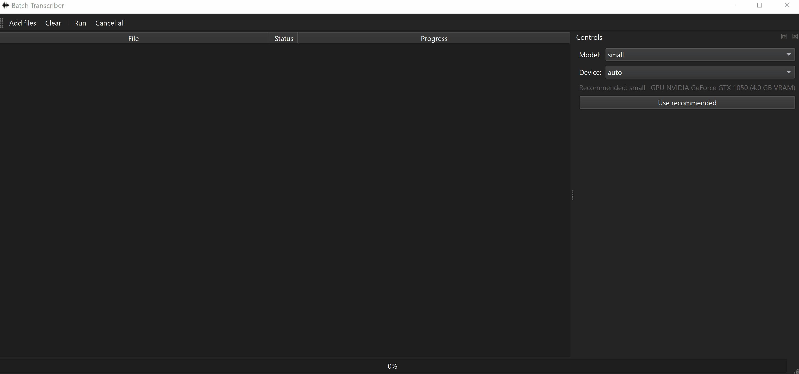

## Demo

## Quick Start — NVIDIA Windows

1. Install Python 3.11 or 3.12.
   - During installation, tick **Add Python to PATH**.
2. Download this repository as a ZIP.
3. Extract the ZIP.
4. Double-click `run_windows_nvidia.bat`.
5. Wait for first-time setup to finish.
6. The app will open automatically.

First launch may take several minutes because the script creates a local `.venv` folder and installs CUDA PyTorch, Whisper, PySide6, and FFmpeg support. After that, future launches are much faster.
This script creates a local .venv folder inside the project directory. It does not install packages into your global Python environment.
First setup can easily require 7–10 GB once CUDA PyTorch, PySide6, Whisper, ffmpeg, and a medium Whisper model are all present.
First setup requires accsess to the internet to download requirements, after that it can run offline!
This software can take any audio and or video file and return an accurate transcription.
Recommened minimum settings for lengthy interviews/files Model size: Medium using CUDA.
Always start the App by double clicking run_windows_nvidia.bat :D
